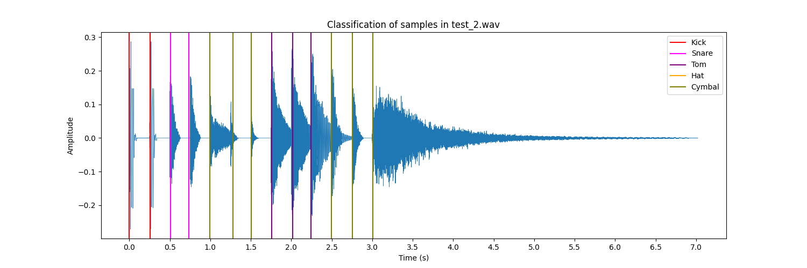

# DLDC: Deep Learning Drum Classifier

## Overview

DLDC is a deep learning model built with PyTorch that timestamps and  classifies drum samples from an audio file into one of 5 classes:

- Kick
- Snare
- Hi-hat
- Tom
- Cymbal

The model is trained on a combination of labeled drum samples from [Kaggle](https://www.kaggle.com/datasets/anubhavchhabra/drum-kit-sound-samples) and [MusicRadar](https://www.musicradar.com/news/drums/1000-free-drum-samples). The model is trained on 5 classes, but can be extended to more classes by adding more labeled samples.

### Example

#### Input

The file [test_sequence_2.wav](test/test_sequence_2.wav). This is a 4 bar drum sequence with 13 drum samples.

#### Plot



####  Output
```
Detected 13 transients
0.000: kick (99.13%)
0.256: kick (99.64%)
0.512: snare (57.97%)
0.736: snare (75.33%)
0.992: cymbal (99.94%)
1.280: cymbal (100.00%)
1.504: cymbal (100.00%)
1.760: tom (100.00%)
2.016: tom (100.00%)
2.240: tom (95.66%)
2.496: cymbal (100.00%)
2.752: cymbal (100.00%)
3.008: cymbal (100.00%)
```

## Dependencies

View the [requirements.txt](requirements.txt) file for a list of dependencies. They are listed below for convenience:

- python 3.7
- numpy 1.20.3
- torch 1.10.2
- librosa 0.9.2
- tqdm 4.65.0
- matplotlib 3.7.1
- soundfile 0.11.0

## Usage

### Training

The repository includes the latest trained model, `model_v0.12.pt`. To train the model yourself, follow the steps below.

1. Tweak the hyperparameters in `train.py` as desired. The default values are:

```py
# hyperparams
num_classes = 5
num_epochs = 250
batch_size = 64
learning_rate = 0.001
```

2. Run `train.py` to train the model with:

```py
python train.py
```

This will save the new model to `model_v0.XX.pt`.

### Classification

1. Run `classify.py` to classify an audio file with:

```py
python classify.py <input_file> [<export_path>]
```

- `input_file` is the path to the audio file to classify
- `export_path` path to export the sliced and classified samples to. If not specified, the detected samples will not be exported. 

After classification, the script will print the resulting transcription to the console, and plot the results to a matplotlib figure.

## Read More

For more information about this project, see the [report](/report/project-report.pdf).

## License

This project is licensed under the GNU GPLv3 license. See the [LICENSE](LICENSE) file for more information.